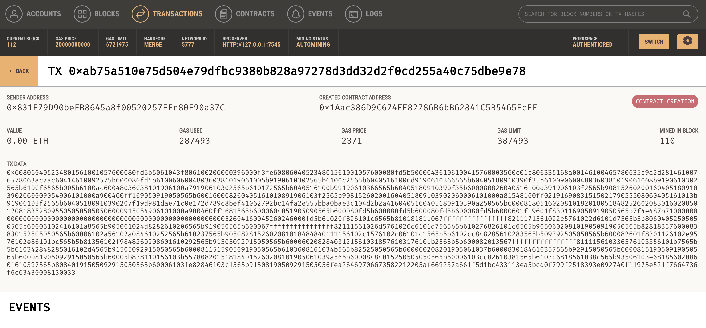
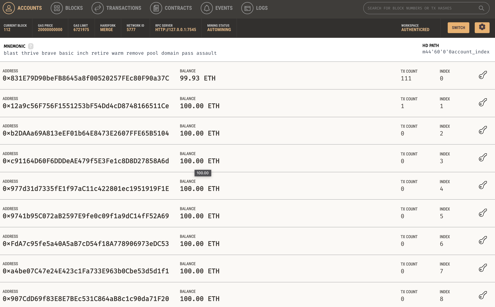

# AuthentiCred Complete Automation

This document explains how to use the comprehensive automation script that handles the entire AuthentiCred setup and startup process.

## What the Script Does

The `start_authenticred.py` script automates the complete AuthentiCred development environment setup:

### **Setup Process**
1. **Dependency Check** - Verifies all required tools are installed
2. **Ganache Startup** - Starts local blockchain on port 8545
3. **Contract Deployment** - Deploys all smart contracts automatically
4. **Environment Configuration** - Updates `.env` file with contract addresses
5. **Database Setup** - Runs Django migrations
6. **Service Startup** - Starts all required services:
   - Redis (via Docker)
   - Celery Worker
   - Celery Beat Scheduler
   - Django Development Server

### **Network Configuration**
- **Ganache**: `http://127.0.0.1:8545` (Localhost 8545)
- **Django**: `http://127.0.0.1:8000`
- **Redis**: `localhost:6379`
- **Metamask**: Configure to connect to `Localhost 8545`

## Prerequisites

Before running the automation script, ensure you have the following installed:

### **Required Dependencies**
```bash
# Node.js and npm
node --version
npm --version

# Ganache CLI
npm install -g ganache

# Python and pip
python --version
pip --version

# Docker
docker --version
```

### **Python Dependencies**
```bash
# Install Python dependencies
pip install -r requirements.txt

# Or if using virtual environment
source .venv/bin/activate
pip install -r requirements.txt
```

## Usage

### **Basic Usage (Complete Setup)**
```bash
# Run the complete setup
python start_authenticred.py
```

### **Advanced Usage (Custom Options)**
```bash
# Skip Ganache (if already running)
python start_authenticred.py --skip-ganache

# Skip contract deployment (if already deployed)
python start_authenticred.py --skip-deploy

# Skip server startup (setup only)
python start_authenticred.py --skip-servers

# Custom ports
python start_authenticred.py --ganache-port 8545 --django-port 8000

# Show help
python start_authenticred.py --help
```

### **Step-by-Step Setup**
```bash
# 1. Setup only (no servers)
python start_authenticred.py --skip-servers

# 2. Start servers only (if already setup)
python start_authenticred.py --skip-ganache --skip-deploy
```

## 📊 What Gets Started

### **Blockchain Services**
- **Ganache**: Local Ethereum blockchain
  - Port: 8545
  - Network ID: 5777
  - Accounts: 10 (1000 ETH each)
  - Deterministic: Yes (same addresses every time)


*Local blockchain development environment with Ganache*


*Pre-funded accounts for development and testing*

### **Web Services**
- **Django**: Main web application
  - URL: http://127.0.0.1:8000
  - Debug mode: Enabled
  - Auto-reload: Enabled

### **🔴 Background Services**
- **Redis**: Message broker for Celery
  - Port: 6379
  - Container: `authenticred-redis`
- **Celery Worker**: Background task processor
  - Pool: Solo (single-threaded)
  - Log level: Info
- **Celery Beat**: Task scheduler
  - Log level: Info

### **Smart Contracts**
The script deploys and configures these contracts:
- **DIDRegistry**: Decentralized Identifier registry
- **TrustRegistry**: Trust management for issuers
- **CredentialAnchor**: Credential anchoring service
- **RevocationRegistry**: Credential revocation service

## Environment Configuration

The script automatically updates your `.env` file with:

```env
# Contract Addresses (auto-generated)
DIDREGISTRY_ADDRESS=0x...
TRUSTREGISTRY_ADDRESS=0x...
CREDENTIALANCHOR_ADDRESS=0x...
REVOCATIONREGISTRY_ADDRESS=0x...

# Blockchain Configuration
BLOCKCHAIN_RPC_URL=http://127.0.0.1:8545
GANACHE_CHAIN_ID=5777
BLOCKCHAIN_NETWORK=ganache

# Django Settings
DEBUG=True
SECRET_KEY=your-secret-key-here-change-in-production
FIELD_ENCRYPTION_KEY=your-encryption-key-here-change-in-production
```

## Metamask Configuration

To connect Metamask to your local Ganache:

1. **Open Metamask**
2. **Add Network**:
   - Network Name: `AuthentiCred Local`
   - RPC URL: `http://127.0.0.1:8545`
   - Chain ID: `5777`
   - Currency Symbol: `ETH`

3. **Import Account**:
   - Use one of the private keys from Ganache output
   - Or use the mnemonic: `test test test test test test test test test test test junk`

## 📱 Using the Application

Once everything is running:

1. **Open Browser**: http://127.0.0.1:8000
2. **Create Account**: Register as an institution or individual
3. **Connect Wallet**: Use Metamask to connect your account
4. **Start Using**: Issue and manage verifiable credentials

## 🛑 Stopping Services

### **Graceful Shutdown**
```bash
# Press Ctrl+C in the terminal running the script
# All services will be stopped automatically
```

### **Manual Cleanup**
```bash
# Stop Redis container
docker stop authenticred-redis
docker rm authenticred-redis

# Kill processes (if needed)
pkill -f "manage.py runserver"
pkill -f "celery worker"
pkill -f "celery beat"
pkill -f "ganache"
```

## Troubleshooting

### **Common Issues**

#### **Ganache Won't Start**
```bash
# Check if port is in use
lsof -i :8545

# Kill existing process
kill -9 <PID>

# Try different port
python start_authenticred.py --ganache-port 8546
```

#### **Contracts Won't Deploy**
```bash
# Check Ganache is running
curl -X POST -H "Content-Type: application/json" \
  --data '{"jsonrpc":"2.0","method":"eth_blockNumber","params":[],"id":1}' \
  http://127.0.0.1:8545

# Redeploy contracts
python manage.py deploy_contracts
```

#### **Django Won't Start**
```bash
# Check dependencies
pip install -r requirements.txt

# Run migrations manually
python manage.py migrate

# Check for port conflicts
lsof -i :8000
```

#### **Celery Issues**
```bash
# Check Redis is running
redis-cli ping

# Restart Celery
pkill -f "celery worker"
python -m celery -A AuthentiCred worker --loglevel=info --pool=solo
```

### **Logs and Debugging**
```bash
# View Django logs
tail -f logs/django.log

# View Celery logs
tail -f logs/celery.log

# Check Ganache logs
# (logs are displayed in the script output)
```

## Manual Commands (Reference)

If you prefer to run things manually, here are the equivalent commands:

### **Start Ganache**
```bash
ganache --port 8545 --network-id 5777 --accounts 10 --default-balance-ether 1000 --deterministic --mnemonic "test test test test test test test test test test test junk"
```

### **Deploy Contracts**
```bash
python manage.py deploy_contracts --skip-abi-update
```

### **Start Redis**
```bash
docker run -d --name authenticred-redis -p 6379:6379 redis:alpine
```

### **Run Migrations**
```bash
python manage.py migrate
```

### **Start Celery Worker**
```bash
python -m celery -A AuthentiCred worker --loglevel=info --pool=solo
```

### **Start Celery Beat**
```bash
python -m celery -A AuthentiCred beat --loglevel=info
```

### **Start Django**
```bash
python manage.py runserver 127.0.0.1:8000
```

## Quick Start Guide

1. **Install Dependencies**:
   ```bash
   npm install -g ganache
   pip install -r requirements.txt
   ```

2. **Run Automation**:
   ```bash
   python start_authenticred.py
   ```

3. **Open Application**:
   - Browser: http://127.0.0.1:8000
   - Metamask: Connect to `http://127.0.0.1:8545`

4. **Start Using**:
   - Create account
   - Connect wallet
   - Issue credentials

That's it! The automation script handles everything else automatically.
