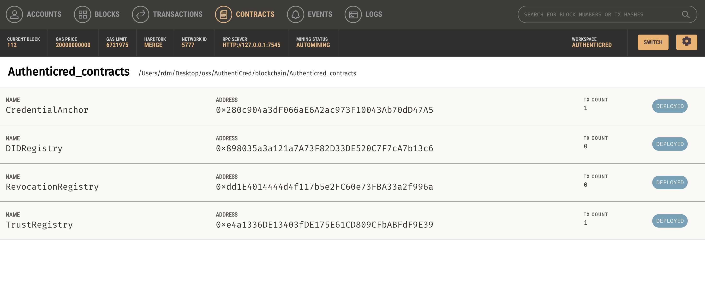
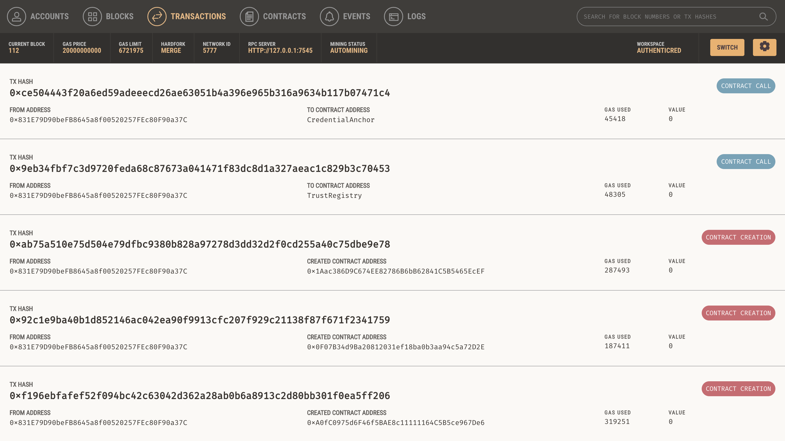

# AuthentiCred Management Commands

This document lists all the essential Django management commands for AuthentiCred.

## Blockchain Commands

### Core Blockchain Operations

#### `deploy_contracts`
Deploys all smart contracts to the blockchain.
```bash
python manage.py deploy_contracts
```

 
*Smart contract deployment and management interface in Ganache*


*Blockchain transaction monitoring for credential operations*

#### `quick_fix_blockchain` ⭐ **RECOMMENDED**
Automatically restores blockchain state after Ganache restart:
- Registers issuers as trusted
- Anchors existing credentials
- Tests verification status
```bash
python manage.py quick_fix_blockchain
```

#### `debug_blockchain`
Provides detailed debugging information about blockchain status:
- Connection status
- Contract addresses
- Verification tests
```bash
python manage.py debug_blockchain --verbose
```

### Blockchain Maintenance

#### `reset_blockchain`
Completely resets blockchain state (use with caution).
```bash
python manage.py reset_blockchain
```

#### `register_all_dids`
Registers all user DIDs on the blockchain.
```bash
python manage.py register_all_dids
```

#### `approve_issuer`
Approves a specific issuer on the blockchain.
```bash
python manage.py approve_issuer <issuer_did>
```

## User Management Commands

#### `create_missing_wallets`
Creates wallets for users who don't have them.
```bash
python manage.py create_missing_wallets
```

## Credential Management Commands

#### `fix_credential_signature`
Fixes credential signatures by updating holder DIDs and re-signing.
```bash
python manage.py fix_credential_signature
```

## Utility Commands

#### `list_commands`
Lists all available management commands with descriptions.
```bash
python manage.py list_commands
```

## Startup Scripts

### `start.sh` ⭐ **MAIN STARTUP SCRIPT**
Automatically starts all services and restores blockchain state:
```bash
./start.sh
```

### `stop.sh`
Stops all running services:
```bash
./stop.sh
```

## Common Workflows

### After Ganache Restart
```bash
./start.sh
# This automatically runs quick_fix_blockchain
```

### Manual Blockchain State Restoration
```bash
python manage.py quick_fix_blockchain
```

### Debug Blockchain Issues
```bash
python manage.py debug_blockchain --verbose
```

### Fix Credential Signatures
```bash
python manage.py fix_credential_signature
```

## Notes

- **`quick_fix_blockchain`** is the main command for restoring blockchain state
- **`start.sh`** automatically handles blockchain state restoration
- **`debug_blockchain`** is useful for troubleshooting
- Most commands are now automated and don't need manual execution
