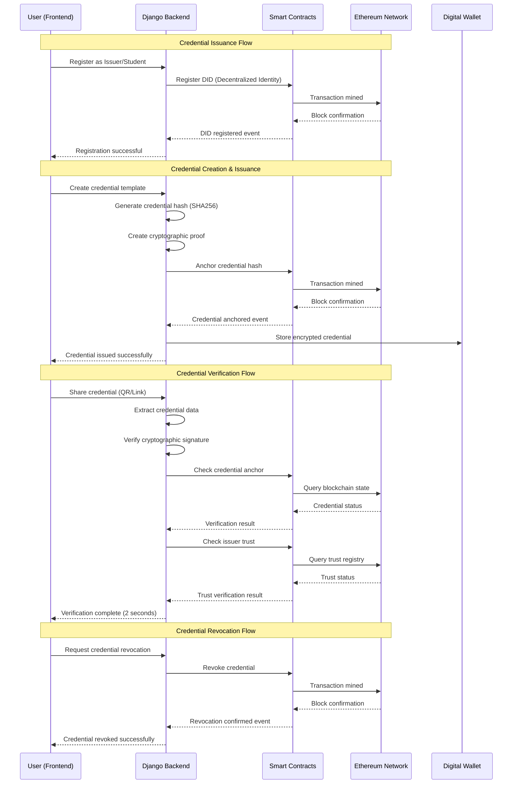
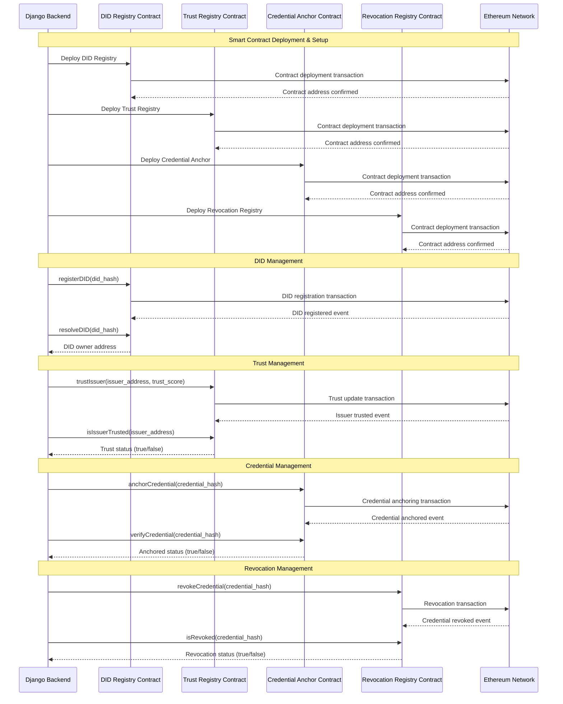
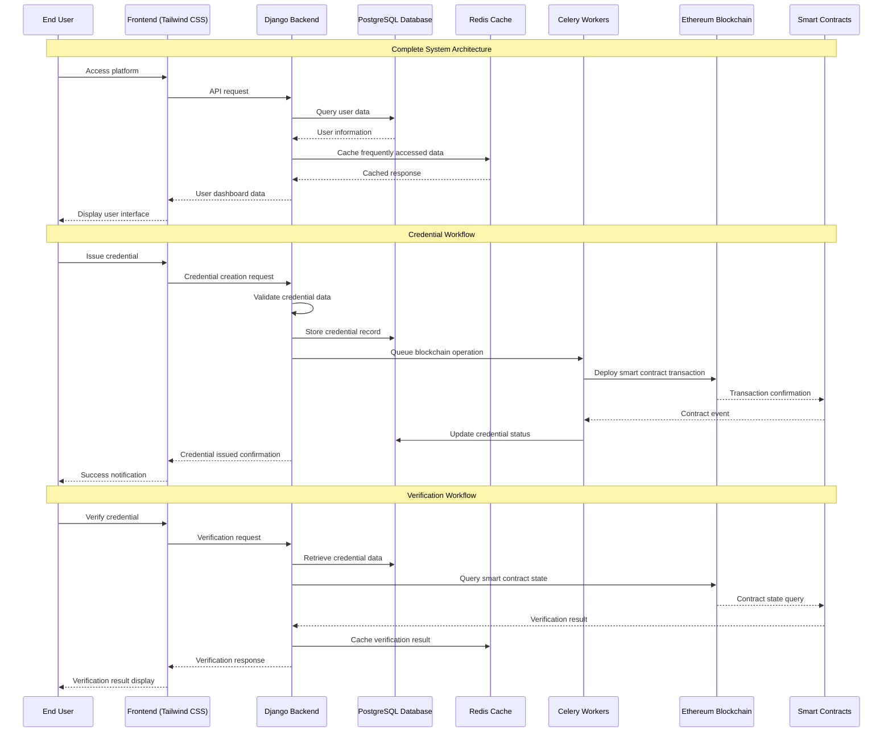

# AuthentiCred Blockchain Interaction Sequence Diagram

## Credential Verification Flow

## Smart Contract Interaction Flow

## System Architecture Flow

## Key Components Description

### **Frontend Layer**
- **Technology**: HTML5, Tailwind CSS, JavaScript
- **Features**: Responsive design, mobile-first approach
- **Components**: User dashboards, credential forms, verification interface

### **Django Backend**
- **Framework**: Django 5.2.5
- **Features**: REST API, authentication, business logic
- **Integration**: Web3.py for blockchain interaction

### **Smart Contracts**
- **DID Registry**: Manages decentralized identities
- **Trust Registry**: Verifies issuer authenticity
- **Credential Anchor**: Stores credential hashes on blockchain
- **Revocation Registry**: Handles credential revocation

### **Blockchain Layer**
- **Network**: Ethereum (Ganache for development)
- **Technology**: Web3.py integration
- **Features**: Real-time transactions, gas optimization

### **Data Flow**
1. **User Interaction**: Frontend receives user input
2. **Backend Processing**: Django validates and processes data
3. **Blockchain Integration**: Smart contracts execute on Ethereum
4. **Confirmation**: Events confirm successful operations
5. **Response**: Results returned to user interface

## Performance Metrics

- **Credential Issuance**: < 5 seconds
- **Verification**: < 2 seconds
- **Blockchain Transaction**: < 30 seconds
- **Database Queries**: < 100ms
- **API Response**: < 200ms

## Security Features

- **Cryptographic**: ECDSA signatures, SHA256 hashing
- **Blockchain**: Immutable credential storage
- **Authentication**: JWT tokens, role-based access
- **Data Protection**: Encryption at rest and in transit

---

*This sequence diagram illustrates the complete flow of the AuthentiCred platform, showing how user interactions flow through the system architecture to provide secure, tamper-proof credential verification.*
