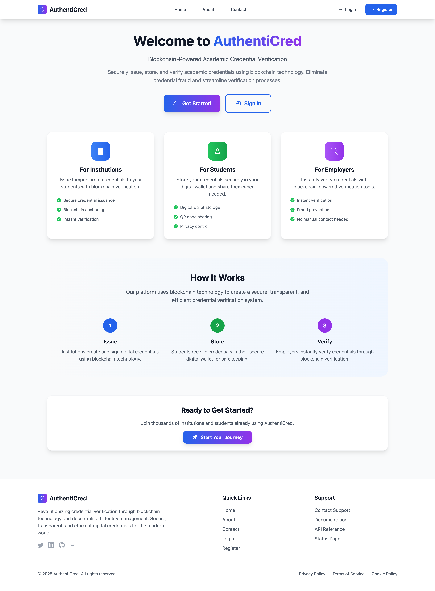
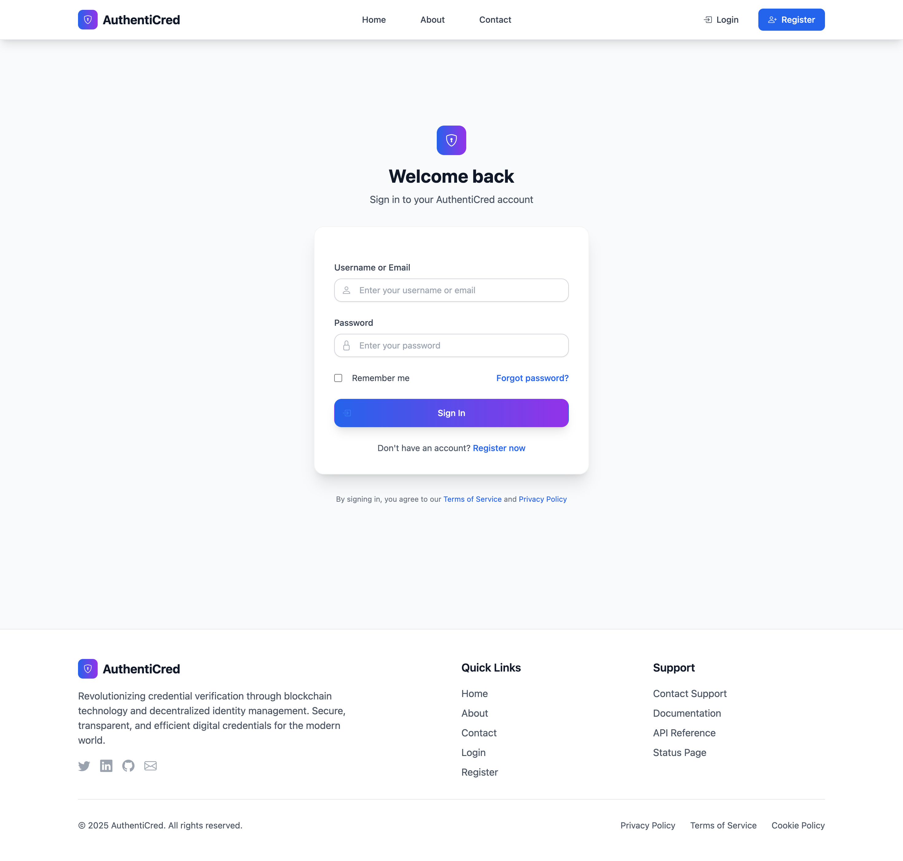
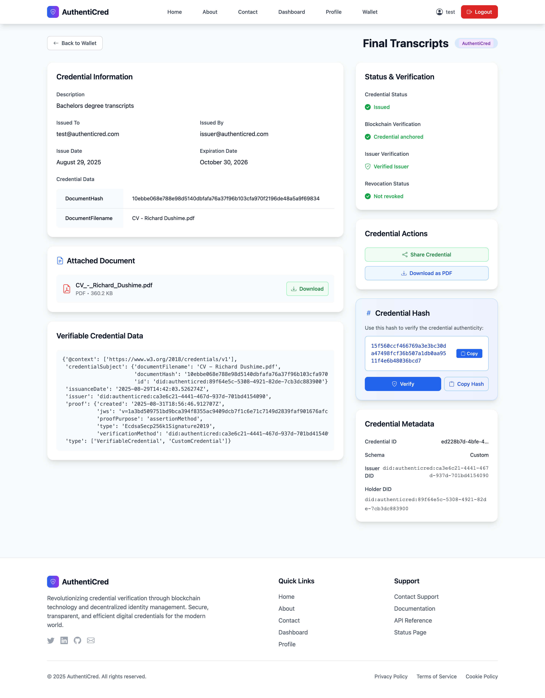
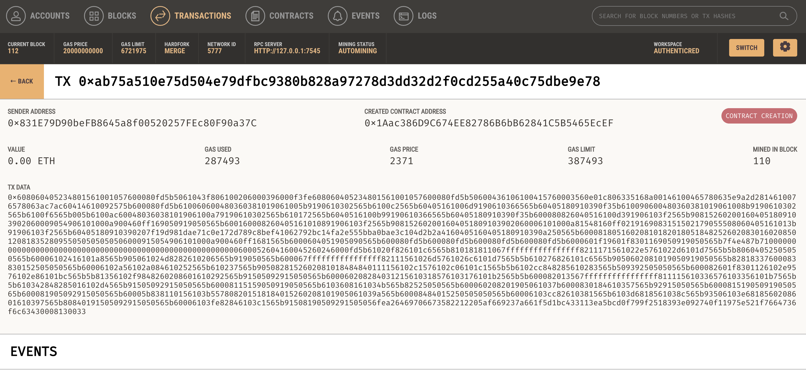

# AuthentiCred

**Where Technology Meets Trust**

*Blockchain-based credential verification platform for the digital age*

[](https://github.com/richarddushime/AuthentiCred)
[](https://python.org)
[](https://djangoproject.com)
[](https://ethereum.org)
[](https://tailwindcss.com)

## Technology Stack

### Frontend
[](https://developer.mozilla.org/en-US/docs/Web/HTML)
[](https://tailwindcss.com)
[](https://developer.mozilla.org/en-US/docs/Web/JavaScript)
[](https://docs.djangoproject.com/en/stable/topics/templates/)

### Backend
[](https://djangoproject.com)
[](https://python.org)
[](https://sqlite.org)
[](https://postgresql.org)
[](https://celeryproject.org)

### Blockchain
[](https://web3py.readthedocs.io/)
[](https://soliditylang.org)
[](https://trufflesuite.com/ganache/)
[](https://ethereum.org)

### Security
[](https://en.wikipedia.org/wiki/Elliptic_Curve_Digital_Signature_Algorithm)
[](https://en.wikipedia.org/wiki/SHA-2)
[](https://jwt.io)
[](https://en.wikipedia.org/wiki/Public_key_infrastructure)

---

## What is AuthentiCred?

**AuthentiCred** is a revolutionary blockchain-based platform that transforms how educational credentials are issued, verified, and shared. Built on cutting-edge blockchain technology and W3C standards, it provides instant, tamper-proof verification of academic achievements.


*The main platform interface showcasing professional design and key features*

### Key Features

- **Cryptographically Secure** - ECDSA signatures and SHA256 hashing
- **Blockchain Anchored** - Immutable credential verification
- **W3C Compliant** - Follows international standards
- **Instant Verification** - Real-time credential validation
- **Beautiful UI** - Modern, responsive design with Tailwind CSS
- **Automated Workflows** - Smart contract-based operations

---

## Technology Stack

### Frontend
- **HTML5** - Semantic markup
- **Tailwind CSS** - Utility-first styling
- **JavaScript** - Interactive features
- **Django Templates** - Server-side rendering

### Backend
- **Django 5.2.5** - Web framework
- **Python 3.13** - Programming language
- **SQLite/PostgreSQL** - Database systems
- **Celery** - Task queue management

### Blockchain
- **Web3.py** - Ethereum integration
- **Solidity** - Smart contracts
- **Ganache** - Development blockchain
- **Ethereum** - Blockchain platform

### Security
- **ECDSA** - Digital signatures
- **SHA256** - Cryptographic hashing
- **JWT** - Authentication tokens
- **PKI** - Key management

---

## Quick Start

### Prerequisites

- Python 3.13+
- Node.js 18+
- Ganache (for local blockchain)
- Git

### Platform Overview


*Secure login interface with modern authentication*


*Professional dashboard for managing credentials and users*


*Comprehensive credential management and verification system*

### Installation

```bash
# Clone the repository
git clone https://github.com/richarddushime/AuthentiCred.git
cd AuthentiCred

# Create virtual environment
python -m venv .venv
source .venv/bin/activate  # On Windows: .venv\Scripts\activate

# Install dependencies
pip install -r requirements.txt

# Install Node.js dependencies
cd theme
npm install

# Start services
./start.sh
```

### What Happens Next?

1. **Ganache** starts with pre-funded accounts
2. **Smart contracts** deploy automatically
3. **Django server** starts on localhost:8000
4. **Celery workers** begin processing tasks
5. **Blockchain state** restores automatically

### Blockchain Development Environment


*Local blockchain development environment with Ganache*


*Smart contract deployment and interaction interface*

---

## Documentation Sections

### [Project Overview](project_report.md)
Complete project documentation with screenshots and visual guides. Perfect for presentations and stakeholder briefings.

### [Technical Architecture](techstacks.md)
Deep dive into blockchain technology, smart contracts, and how everything works together.

### [Technical Documentation](documentation.md)
Comprehensive technical specifications, data models, and system architecture details.

### [Management Commands](management_commands.md)
Essential Django management commands for debugging, fixing, and maintaining the system.

### [Automation Guide](AUTOMATION_README.md)
Complete setup and automation instructions for development and deployment.

---

## Development Workflow


---

## Why Choose AuthentiCred?

### For Institutions
- **Instant Verification** - No more manual credential checks
- **Global Recognition** - W3C standards ensure interoperability
- **Cost Reduction** - Automated processes reduce administrative overhead
- **Enhanced Security** - Blockchain prevents credential forgery

### For Students
- **Portable Credentials** - Access credentials from anywhere
- **Instant Sharing** - Share with employers and institutions instantly
- **Privacy Control** - Selective disclosure of credential information
- **Lifetime Access** - Credentials stored securely forever

### For Verifiers
- **Real-time Verification** - Instant credential validation
- **Trust Assurance** - Cryptographic proof of authenticity
- **Global Access** - Verify credentials from anywhere
- **Cost Efficiency** - No need for manual verification processes

---

## Contributing

We welcome contributions from the community! Whether you're a developer, designer, or blockchain enthusiast, there are many ways to get involved.

- **Report Bugs** - Help us improve by reporting issues
- **Suggest Features** - Share your ideas for new functionality
- **Submit Code** - Contribute code improvements and new features
- **Improve Docs** - Help make our documentation even better
- **Spread the Word** - Share AuthentiCred with your network

See our [Contributing Guide](contributing.md) for more details.

---

## Support & Community

- **GitHub Issues**: [Report bugs and request features](https://github.com/richarddushime/AuthentiCred/issues)
- **Discussions**: [Join community conversations](https://github.com/richarddushime/AuthentiCred/discussions)
- **Wiki**: [Additional resources and guides](https://github.com/richarddushime/AuthentiCred/wiki)
- **Email**: [contact@authenticred.com](mailto:contact@authenticred.com)

---

## License

This project is licensed under the MIT License - see the [LICENSE](https://github.com/richarddushime/AuthentiCred/blob/main/LICENSE) file for details.

---

**Made with dedication by the AuthentiCred Team**

*Building the future of credential verification, one block at a time*

[Get Started →](project_report.md)
